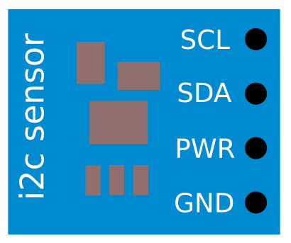
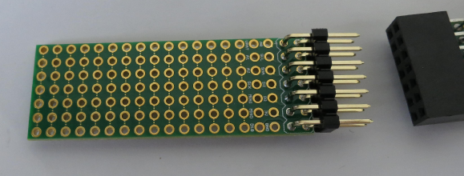
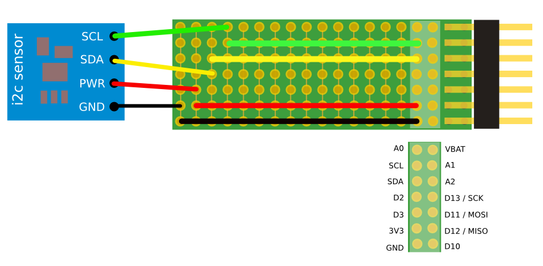

# Measuring temperature using an i2c temperature sensor using a Riffle

**Note**: If this is your first time programming a Riffle, you'll probably want to check out the [Riffle: Getting Started instructions](https://github.com/dwblair/Riffle-Getting-Started), which will show you how to set up the Arduino IDE and the Riffle for programming and datalogging.

## i2c basics

[i2c](https://en.wikipedia.org/wiki/I%C2%B2C) refers to a particular electronic communications protocol that can be used by microntrollers like the Arduino and the Riffle.  It is a "bus" system that allows more than one device to communicate at once, through the use of an addressing system. 

This means that, for example, an i2c temperature sensor and an i2c light detector can both be connected to the i2c bus lines on the Riffle, and they can be polled for their sensor values without interfering with one another.

Typically, for Arduino-like systems, i2c performance starts to degrade with wires that are more than a meter or two in length -- so it is bested used for nearby sensors.

Sparkfun has a nice [online i2c tutorial](https://learn.sparkfun.com/tutorials/i2c) that explains the concepts in more detail.

In this guide, we'll cover how to set up an i2c sensor to a Riffle.  

As on the Arduino, i2c requires two signal lines, which are special i2c lines reserved on the Riffle: **SDA** and **SCL**.  The Riffle requires customized code for being able to communicate over i2c with a given sensor -- for most popular sensor chips, libraries already exist to allow this communication, and these libraries will need to be installed.

To connect the Riffle to a 3.3V i2c sensor, you must power the sensor (provide it with **3.3V** and **GND**) and also connect the **SDA** and **SCL** lines.

## i2c temp and pressure sensor example

As an example, we'll be setting up a [BMP180](https://cdn-shop.adafruit.com/datasheets/BST-BMP180-DS000-09.pdf) i2c sensor. 

The BMP180 is a popular, inexpensive chip that is sold as a breakout board by hobby electronics companies like Adafruit and Sparkfun.  It will accept up to 5V, but can be powered by 3V, which is ideal for the Riffle (which runs at 3.3V).

It has the following specifications:

- Pressure sensing range from 300-1100 hPa
- 0.03 hPa / 0.25 meter resolution
- -40 to +85 C operational range, with +/- 2C accuracy

## i2c Circuit

As noted above, we simply need to connect the PWR, GND, SCL, and SDA lines directly to the corresponding pins on the Riffle.

**NOTE:**  Usually, i2c devices require 'pullups' -- resistors that connect the signal lines (SCL and SDA) to the power line.  On the Riffle, these 'pullups' are already present on the main Riffle board (they are needed for other i2c chips on the Riffle).  So you do not need to provide i2c pullups in your own circuit.  If these pullup resistors are already present on the board you are using, they usually won't interfere with your measurement.  

## i2c Sensor connected to a Riffle Protoboard

The Riffle protoboard connects to the end of the Riffle, making it easier to connect sensor wires to the Riffle in a secure fashion:

Below is a picture of an i2c sensor connected to the Riffle protoboard.  Take special care to connect wires to the appropriate rows and columns in order to achieve the proper electrical connectivity. 

## Code for i2c Temperature Sensor Datalogging with a Riffle

The Arduino code "riffle_bmp180.ino" in this repository will measure temperature using a bmp180 breakout board set up as in the above schematic, and record it to a microSD card along with a timestamp. 

1. Download this entire repository using the button on this page above (or [this link](https://github.com/dwblair/riffle-i2c/archive/master.zip) should work).  

2. Copy all of the libraries labeled in the "libraries" folder to the "libraries" folder in your Arduino IDE "sketchbook" folder.

3. Then, upload the "riffle_bmp180.ino" code onto the Riffle, choosing "Arduino UNO" as the board type. 

This code will start measuring temperature the BMP180 sensor.  
 
The data is output in "TSV" format, with tabs separating columns of data (timestamp in the first column, thermistor in the third column).

# How you can contribute

Some useful guidelines about the best way to contribute to the project (or to fork it) can be found [here](contributing.md).

# Support and Licensing 

The Riffle_328 project has been supported through [Public Lab](www.publiclab.org)'s Open Water Initiative, and is licensed under [CERN OHL 1.2](LiCENSE.md).

